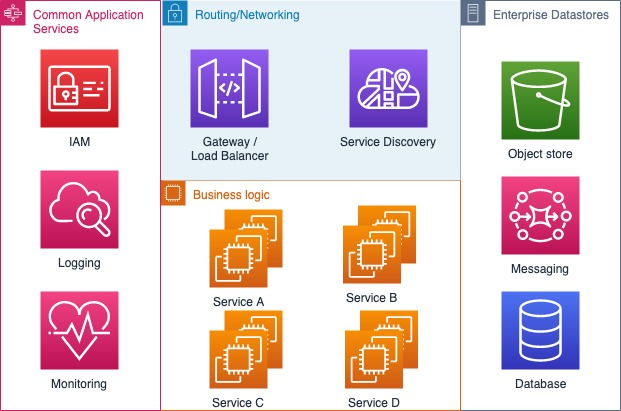

# Opdracht

Het doel van deze opdracht is om een eenvoudige eerste versie van een **Verhuur-een-auto API** te bouwen. De **Verhuur-een-auto API** 
moet gebouwd worden volgens de microdienst principes.

#### Wat is een **microdienst**?

Microdiensten zijn kleine, autonome diensten die samenwerken. 
Laten we die definitie een beetje afbreken en kijken naar de kenmerken die microdiensten anders maken.

Hieronder zie je een algemene architectuur hoe je een microdienst applicatie kunt bouwen en in elkaar zetten.

#### Verhuur-een-auto API

De **Verhuur-een-auto API** is een REST API die het mogelijk maakt om voertuigversies, 
klanten en andere gegevens die nodig zijn voor een makelaar te onderhouden.

De eindgebruikers van de **Verhuur-een-auto API** zijn:

- Makelaars die de verhuurprijs voor een klant berekenen en klantgegevens bijhouden.
- Verhuurmaatschappij die gegevens bijhoudt om een nauwkeurige berekening te kunnen maken.

## Functionele vereisten

De **Verhuur-een-auto API** heeft de volgende _functionele eisen_:

- U kunt een klant onderhouden (toevoegen, wijzigen en verwijderen). (Naam, straat, huisnummer, postcode, plaats, email, telefoonnummer)
- U kunt basis autodata attributen onderhouden
    - Merk
    - Model
    - Versie
    - Aantal deuren
    - CO2-uitstoot
    - Bruto prijs
    - Nettoprijs
- De verhuurtarief is afhankelijk van de volgende parameters:
    - Kilometerstand, het aantal kilometers op jaarbasis
    - Duur van het contract in maanden
    - Rentevoet met begindatum
    - Nettoprijs
- Verhuurtarief = (( kilometerstand / 12 ) * looptijd ) / Nettoprijs) + (( rentevoet / 100 ) * Nettoprijs) / 12 )
- Voorbeeld berekening:
    - Kilometerstand: 45000 km/jaar
    - Duur: 60 maanden
    - Rentevoet: 4.5%
    - Nettoprijs: € 63000
    - Verhuurprijs: € 239,76 per maand**
- De makelaar en de medewerkers die de gegevens bijhouden, moeten aanmelden op de API voordat een volgende oproep kan worden gedaan.
- De identiteit moet bij elke aanroep gevalideerd worden.

## Niet-functionele vereisten

- De **Verhuur-een-auto API** is gebouwd met Java 8+ met Springboot 2.1.x
- Onderhoudbaarheid is belangrijker dan prestatie. Er zouden geen complexe prestatie-optimalisaties nodig moeten zijn.
  Een andere ontwikkelaar zou in staat moeten zijn om verder te gaan waar jij gebleven was.
- Het moet dienst-aan-dienst communicatie bevatten
- Voeg fiche-gebaseerde beveiliging toe (oauth/jwt)
- Een in-geheugen dataopslag kan gebruikt worden in deze eerste versie.
- Documenteer je code (javadoc)
- Schrijf eenheidstesten voor je code.
- Gebruik de Google Java Style Guide [link](https://google.github.io/styleguide/javaguide.html)

## Bonus doelstellingen

De volgende zijn niet verplicht, maar kunnen gezien worden als extraatjes:

- Gebruik Swagger om te documenteren naar REST API
- Sla de data op in een persistente datastore
- Maak de service klaar voor containerisatie

## Opleveringen

Deze opdracht moet op de volgende manier opgeleverd worden:

- Alle code wordt doorgerstuurd naar een git-achtige (persoonlijke) repository (github/gitlab/bitbucket).
- Documentatie wordt geleverd in de [README.md](README.md) over hoe de API werkt, en **hoe het uit te voeren**.
- Alle informatie, (dummy)-data, bestanden, en andere assets die nodig zijn om deze API te draaien, worden in deze repository aangeboden.

## Tips en opmerkingen

- Denk aan wat je aan het bouwen bent als een echt **Product**. Denk aan je eindgebruikers en wat zij willen.
- Kies een geschikte datastructuur voor het modelleren van de auto- en klantgegevens. 
- Ontwerp uw API op een intuïtieve manier, ontwerp het volgens de best practices van de API technologie die u kiest
- Werk op een agile manier! Het is mogelijk dat je niet alle functies voor deze opdracht binnen de gestelde tijd kunt implementeren,
  dus wees slim in het kiezen van de functies waar je het eerst aan werkt.